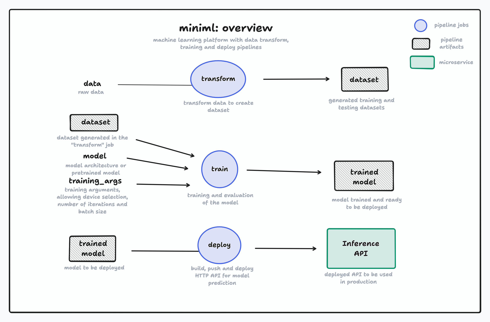

## iFood MLE3 Challenge



Challenge description can be found on `challenge.md`. The proposed platform/framework is baptized as **miniml**, an evolution of [MLJam](https://github.com/paulopacitti/ifood-mle2-challenge). It's divided in 3 main jobs:
- **transform**: transform data and generate datasets. Implemented in `data/` with the `transform.yml` GitHub Actions workflow.
- **train**: train a model. Implemented in `train/` with the `train.yml` workflow.
- **deploy**: model inference API deploy. Implemented in `api/` withe the `deploy.yml` workflow. 

The example implemented to demonstrate this prototype is a fine tuning of the [google-bert/bert-base-cased"](https://huggingface.co/google-bert/bert-base-cased), an encoder-only transformer model, on the [Yelp/yelp_review_full](https://huggingface.co/datasets/Yelp/yelp_review_full) dataset. The model is trained with the task of sequence classification: given a written [Yelp](https://en.wikipedia.org/wiki/Yelp) review, predict the rate in number of stars from 1 to 5.

- [iFood MLE3 Challenge](#ifood-mle3-challenge)
- [miniml](#miniml)
  - [transform](#transform)
  - [train](#train)
  - [deploy](#deploy)
- [Cloud Architecture Proposal within AWS](#cloud-architecture-proposal-within-aws)
  - [Inference API](#inference-api)
- [Bonus](#bonus)
- [Log](#log)

## miniml

This is a one-stop-shop machine learning platform prototype, where it can be used to prepare datasets, train ML models and deploy inference APIs. The **miniml** platform is intended to be generic, so datasets, models, traning arguments and deploy adjustments can be set for any purpose.

Still, since this is a **prototype** made in 4 days, many of these ideas are using simple solutions and where it's supposed to be generic and parametrized, it's not 100% working. All of these ideas were implemented using `transformers` and `fastapi` libs and GitHub Actions to perform the ML jobs. For the example implemented, the pipelines and code are working as expected.

### transform

This job intends to, given raw data, transform into a dataset ready to be used for ML training, hence the name. For the sake of this implementation, the [transform code](./miniml/data/main.py) only place the data in the right columns, shuffle it (the data) and select a range. The result is a saved dataset into a GitHub Actions artifact. The job has the following arguments:
- `dataset-id`: HuggingFace dataset id (defaults to `Yelp/yelp_review_full`, which the code sample works)
- `train-test-split-ratio`: assuming that the raw data comes in one split, partionates the transformed data into `train` and `test` datasets (defaults to `0.2`, meaning `0.2` of the transformed samples will be saved in the `test` dataset)

### train

This job intends to train a mode. The arguments determine which will be the base model to fine-tune, but an architecture from scratch could be implemented in the [code](./miniml/train/main.py). It downloads the most recent dataset previously trained and saved as an GitHub artifact in the `transform` job to perform the training. Evaluation of the model is also performed, but the implementation is not finished. The idea would be to export a report on the training, showing its resulted accuracy and training loss over time. The train job has the following arguments:
- `model-id`: HuggingFace model ID. Defaults to `google-bert/bert-base-cased"`, which the task of [sequence classification] works.
- `batch-size`: set the batch size for training. Defaults to `2`.
- `iterations`: max iterations to perform training (there could also be an argument related to number of epochs, but since this job will run in a CPU and the model is large, unfortunately we have to restrain the training to few steps). Defaults to `200`
- `device`: the `torch` device to run the training (`cuda`, `mps`...). Defaults to `cpu`.

The output of this jobs is the model (or weights) itself, saved as a GitHub artifact.

### deploy

This job intends to deploy the model within an Inference API. The model is downloaded from the latest output of the `train` job. The model is then placed in a REST API implemented with `fastapi` for inference. For this protype, the job only builds and pushes the image into the repo's container registry, but it could easilly run in a container run engine like Google Cloud Run or even a Kubernetes cluster. I would place into Google Cloud Run, but for cost reasons, I decided to leave only in the free GitHub registry to be ran locally. It can be ran locally with:
```sh
docker run -p 8000:8000  ghcr.io/paulopacitti/ifood-mle3-challenge/miniml-api:latest
```

It contains a documentation implemented with Swagger that can be accessed in `localhost:8000/docs` once the container starts running.

## Cloud Architecture Proposal within AWS

### Inference API

## Bonus


```
BUILDING. LOCKED IN. WAIT UNTIL TUESDAY
```


## Log

- `2025-02-21T16:57:22-03:00`: uploading the data transform pipeline
- `2025-02-23T12:56:42-03:00`: change dataset and added train script
- `2025-02-23T15:09:10-03:00`: add api with swagger
- `2025-02-24T14:35:28-03:00`: start documentation
