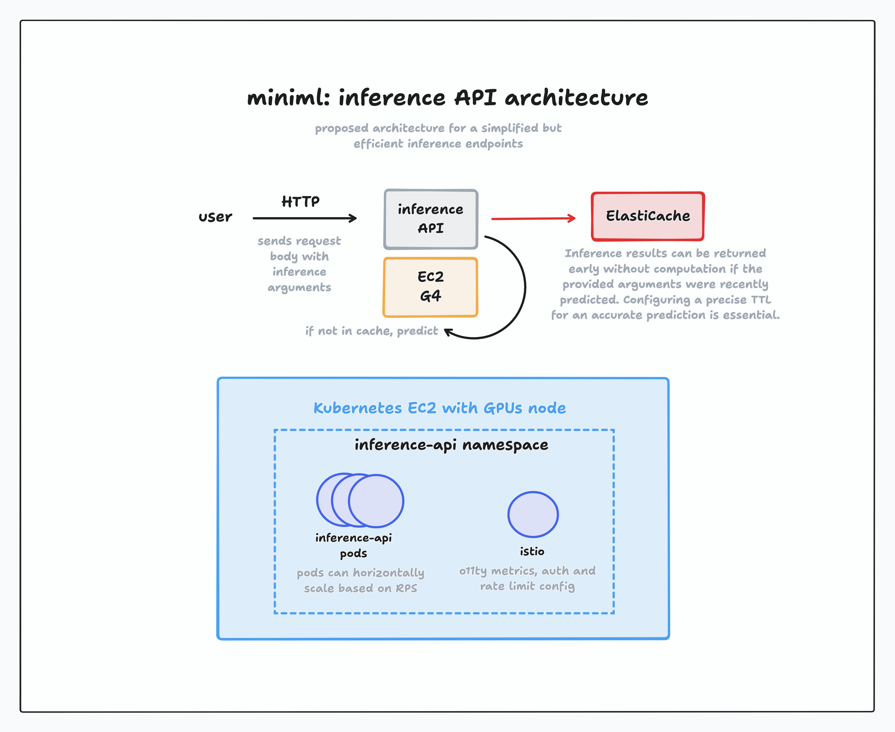

## iFood MLE3 Challenge


Challenge description can be found on `challenge.md`. The proposed platform/framework is baptized as **miniml**, an evolution of [MLJam](https://github.com/paulopacitti/ifood-mle2-challenge). It's divided in 3 main jobs:
- **transform**: transform data and generate datasets. Implemented in `data/` with the `transform.yml` GitHub Actions workflow.
- **train**: train a model. Implemented in `train/` with the `train.yml` workflow.
- **deploy**: model inference API deploy. Implemented in `api/` withe the `deploy.yml` workflow. 

The example implemented to demonstrate this prototype is a fine tuning of the [google-bert/bert-base-cased](https://huggingface.co/google-bert/bert-base-cased), an encoder-only transformer model, on the [Yelp/yelp_review_full](https://huggingface.co/datasets/Yelp/yelp_review_full) dataset. The model is trained with the task of sequence classification: given a written [Yelp](https://en.wikipedia.org/wiki/Yelp) review, predict the rate in number of stars from 1 to 5.

- [iFood MLE3 Challenge](#ifood-mle3-challenge)
- [miniml: the framework](#miniml-the-framework)
  - [transform](#transform)
  - [train](#train)
  - [deploy](#deploy)
- [cloud: AWS infrastructure proposal for miniml](#cloud-aws-infrastructure-proposal-for-miniml)
  - [transform](#transform-1)
  - [train](#train-1)
  - [deploy](#deploy-1)
    - [Inference API](#inference-api)
- [Bonus](#bonus)
  - [level01](#level01)

## miniml: the framework

This is a one-stop-shop machine learning platform prototype, where it can be used to prepare datasets, train ML models and deploy inference APIs. The **miniml** platform is intended to be generic, so datasets, models, traning arguments and deploy adjustments can be set for any purpose.

Still, since this is a **prototype** made in 4 days, many of these ideas are using simple solutions and where it's supposed to be generic and parametrized, it does not work for all the different possible parameters. All of these ideas were implemented using [transformers](https://huggingface.co/docs/transformers/en/index), [PyTorch](https://pytorch.org/) and [fastapi](https://fastapi.tiangolo.com/) libs, and, [GitHub Actions](https://docs.github.com/en/actions) to perform the ML jobs. For the example implemented, the pipelines and code are working as expected.

### transform

This job intends to, given raw data, transform into a dataset ready to be used for ML training, hence the name. For the sake of this implementation, the [transform code](./miniml/data/main.py) only place the data in the right columns, shuffle it (the data) and select a range. The result is a saved dataset into a GitHub Actions artifact. The job has the following arguments:
- `dataset-id`: HuggingFace dataset id (defaults to `Yelp/yelp_review_full`, which the code sample works)
- `train-test-split-ratio`: assuming that the raw data comes in one split, partionates the transformed data into `train` and `test` datasets (defaults to `0.2`, meaning `0.2` of the transformed samples will be saved in the `test` dataset)

### train

This job intends to train a mode. The arguments determine which will be the base model to fine-tune, but an architecture from scratch could be implemented in the [code](./miniml/train/main.py). It downloads the most recent dataset previously trained and saved as an GitHub artifact in the `transform` job to perform the training. Evaluation of the model is also performed, but the implementation is not finished. The idea would be to export a report on the training, showing its resulted accuracy and training loss over time. The train job has the following arguments:
- `model-id`: HuggingFace model ID. Defaults to `google-bert/bert-base-cased`, which the task of [sequence classification] works.
- `batch-size`: set the batch size for training. Defaults to `2`.
- `iterations`: max iterations to perform training (there could also be an argument related to number of epochs, but since this job will run in a CPU and the model is large, unfortunately we have to restrain the training to few steps). Defaults to `200`
- `device`: the `torch` device to run the training (`cuda`, `mps`...). Defaults to `cpu`.

The output of this jobs is the model (or weights) itself, saved as a GitHub artifact.

### deploy

This job intends to deploy the model within an Inference API. The model is downloaded from the latest output of the `train` job. The model is then placed in a REST API [implemented](./miniml/api/) with `fastapi` for inference. For this protype, the job only builds and pushes the image into the repo's container registry, but it could easilly run in a container run engine like Google Cloud Run or even a Kubernetes cluster. I would place into Google Cloud Run, but for cost reasons, I decided to leave only in the free GitHub registry to be ran locally. It can be ran locally with:
```sh
docker run -p 8000:8000 ghcr.io/paulopacitti/ifood-mle3-challenge/miniml-api:latest
```

It contains a documentation implemented with Swagger that can be accessed in `localhost:8000/docs` once the container starts running.

There's also a version trained locally with MPS (Metal Perfomance Shaders) with a 1000 steps and `batch_size = 8`, lasting ~40 minutes, training loss at 0.4787183036804199. This is the version with the best accuracy. It can be run locally with:

```sh
docker run -p 8000:8000 ghcr.io/paulopacitti/ifood-mle3-challenge/miniml-api:1000-steps
```

Here are some examples of predictions done my this model:

- Example #1:
  - Request:
  ```
  curl -X 'POST' \
  'http://0.0.0.0:8000/predict' \
  -H 'accept: application/json' \
  -H 'Content-Type: application/json' \
  -d '{
    "text": "First off, let me say that I find the people who usually work at Dave and busters usually don'\''t care or seem to be angry and hate their job. A friend and I went here and found that a couple of the machines ran out tickets and someone was always there and happy to help. The staff went out of their way to make sure we had a good time. The manager Tony was very sweet and made sure everything was ok. Every staff member we talked to was extremely nice. This is by far the best Dave and busters I'\''ve had been to!"
  }'
  ```
  - Response:
  ```
  {
    "label": "5",
    "score": 0.9986338019371033
  }
  ```
- Example #2:
  - Request:
  ```
  curl -X 'POST' \
  'http://0.0.0.0:8000/predict' \
  -H 'accept: application/json' \
  -H 'Content-Type: application/json' \
  -d '{
    "text": "Good pizza and i love the breadsticks...i don'\''t know too much else about this place"
  }'
  ```
  - Response:
  ```
  {
    "label": "3",
    "score": 0.9985559582710266
  }
  ```

## cloud: AWS infrastructure proposal for miniml


Even that iFood uses the [SageMaker](https://aws.amazon.com/sagemaker/) product, I tried to propose a different vision tied to a future where ML at iFood will deploy their own infrastructure to be able to scale more and to be more cost efficient. Because of this, I chose to use more raw compute services like EC2 and simpler services, imagining a scenario where this first prototype needs to be deployed quickly.

### transform

On the infrastructure, this job could be implemented as triggered compute job in a general-purpose or memory EC2 to transform data. One suggestion would be using the [M7g instances](https://aws.amazon.com/ec2/instance-types/m7g/) with the AWS Graviton 3, which has great performance at a low cost, partially because of its ARM architecture (where iFood have been trying and havong good cost resutls). The transform job would accept its parametes just as briefly described in the protoype with GitHub Actions, and also the raw data itself, which could be stored in [S3](https://aws.amazon.com/s3/).

After the data is transformed and the dataset is generated, the job could post it into a service, as is called in the diagram, "dataset hub". This dataset hub would manage the datasets stored in a S3, allowing uploading and downloading datasets, for training models, for example. This service could be implemented in any language (Go, for example, since it's a great language to build web services) and it shouldn't be so complex to implement it. This "dataset hub" can be deployed in a general-purpose node in iFood's Kubernetes infrastructure since it's a simple web service.

### train

For training, this can run in a EC2 instance with a GPU powerful enough to train the majority of models inside iFood. To be more cost effective, the [Trn1 instances](https://aws.amazon.com/ec2/instance-types/trn1/) with the custom AWS Trainium chips for ML workloads could help a lot, however, their software support with the [Neuron SDK](https://awsdocs-neuron.readthedocs-hosted.com/en/latest/) is not comparable to Nvidia's CUDA. Because of this, I suggested using the [G4 instances](https://aws.amazon.com/ec2/instance-types/g4/), with [Nvidia T4 chips](https://www.nvidia.com/en-us/data-center/tesla-t4/). which are cost-effective. The job itself downloads the model from the previously mentioned "dataset hub" and accept the training arguments for the selected training. 

Once the training finishes, it should generate a report of the training and then save the model in a service called "model registry". Using S3 as storage, the "model registry" is reponsible on managing models (upload/download), to be later used for fine-tuning workdloads or for inference. Saving the model in the right format to protect against attacks such as weight poisoning is crucial. The "model registry" can be deployed in a general-purpose node in iFood's Kubernetes infrastructure since it's a simple web service.

### deploy

The deploy job can run in a general-purpose instance (do not need to be powerful) like the suggested M7g or even [M6g](https://aws.amazon.com/ec2/instance-types/m6g/) with Amazon Graviton 2, since it's only role is to build an image, push it to the registry and trigger a new deploy. This can be done by loading the model from the "model registry". put it in a docker image containing the API code, push it to the registry (it can be [AWS ECR](https://aws.amazon.com/ecr/)), and then trigger the deploy of the API that will serve the model. This API can be run in a EC2 instance with a GPU, like the suggested G4, for faster inference. The next section will describe a simple architecture on how a Inference API could be architected.

#### Inference API



Not so different from the API code implemented in this repo, a Python (the most supported programming language to do ML, since most tensor libraries are built with it) web service with FastAPI and PyTorch to serve it is enough. FastAPI really do a great job on building an API that can scale.

The service could be optimized by attaching it in-memory database for caching, like [ElastiCache](https://aws.amazon.com/elasticache/). That way, previous requests with the same parameters, or, close enough parameters (to be defined custom for the model served), should returned the previously cached prediction. A proper cache TTL should be set so the predictions are not "expired" and inform wrongly to the user.

This service can be hosted in iFood's Kubernetes infrastructure, but on a node that has a GPU powerful enough to serve the load of inferences requested. Kubernetes has many features that its abstraction layer provides, such as horizontal scaling, load balancing and restarting services that are crashing. In this proposal I suggested using the EC2 P4, but it could be the best that suit the job. In Kubernetes, the Inference API could scale horizontally with the proper HPA (Horizontal Pod Autoscaling) config. To serve better, attaching a [Istio](https://istio.io/) service, as iFood is enforcing, is super useful since it can be attached in the service mesh for service discovering as well rate limiting configs.

## Bonus

### level01

**Flag**: `1F00d{P13c3_0f_C4k3}`

Using `objdump` to check the assembly of the binary and the `strings` command, I managed to find the password accepted by the application.
